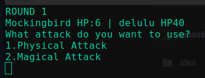
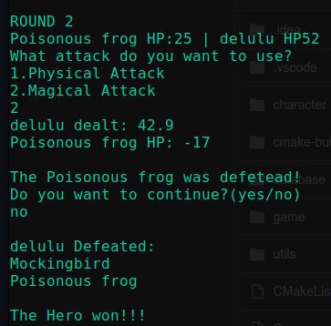

# ErPiGi - C++ CLI Game

**ErPiGi** is a C++ CLI Game for Programing Project Course

# How to get the game

First you have to clone the repository on your machine:

```bash
git clone https://github.com/deceneu009/ErPiGi.git
```

### For Linux:

```bash
mkdir build
cd build
cmake ..
make
```

### For Windows:

You open the executable `Game.exe` from the main folder in a terminal.

```bash
./Game.exe
```

# How to play the game

- You choose your character's `name`.
- You choose what `Element` does your character posses (`fire`, `water`, `earth` and `nature`).
- You choose your character's speciality (`Rogue`, `Warrior`, `Mage` and `Defender`)
- You choose the difficulty of the session of this game (`1`: Easy, `2`: Normal and `3`: Hard. `Default`: `2`)
- The rest is history...

# Preview

 <br>


# Contributions

### Tabusca Stefan-Valentin

- Hero implementation
- Gameplay implementation
- Database implementation
- Game story

### Kalciov Francisc-Sebastian

- Enemy implementation
- Levels implementation
- Clean code
